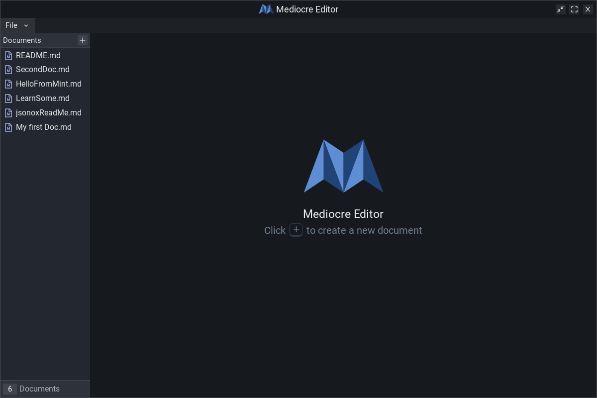
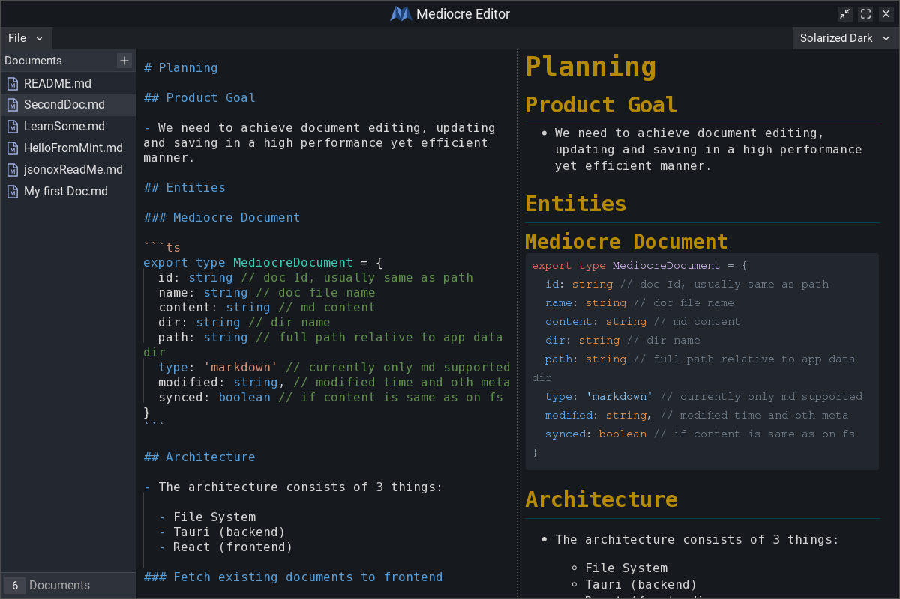
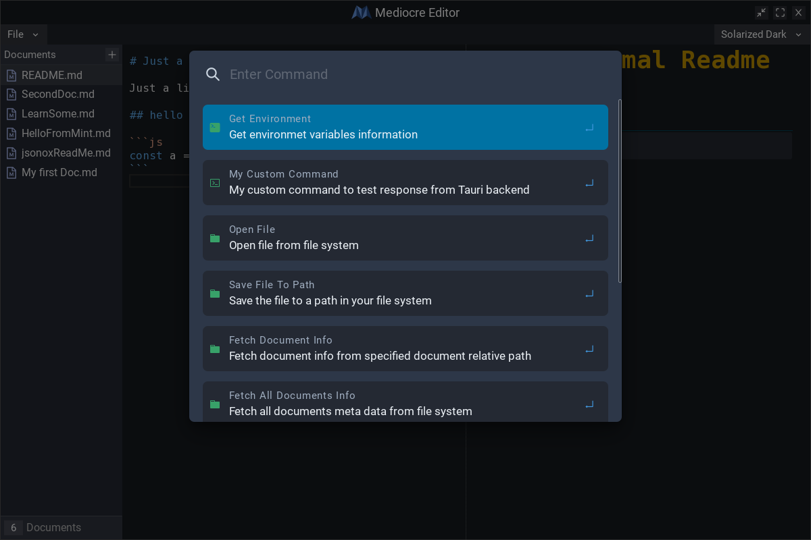
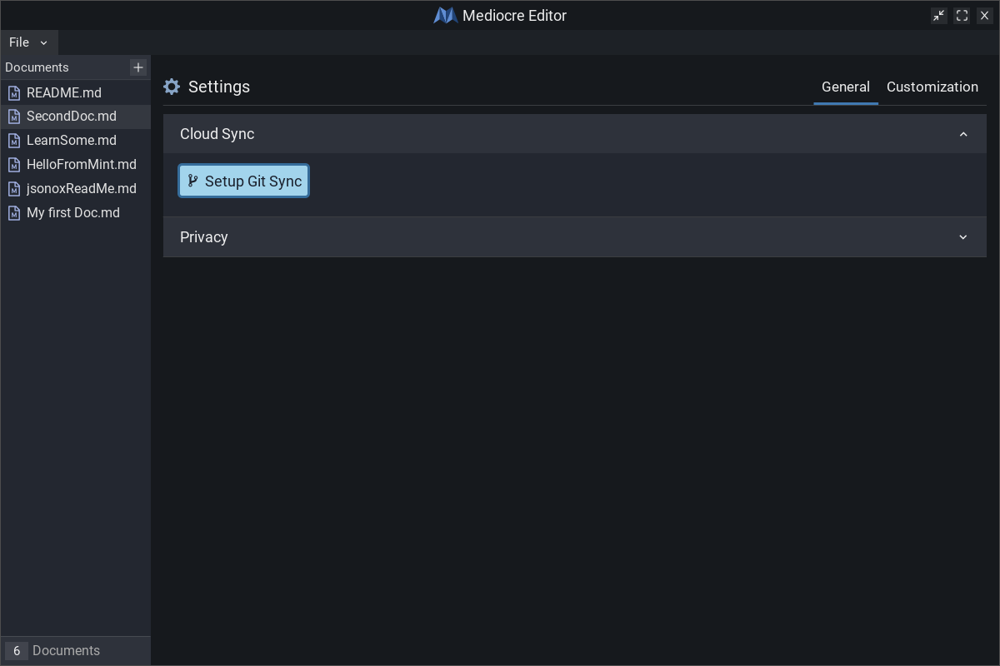

# Mediocre

Simple markdown note maker (with Git sync) using [Tauri](https://tauri.studio/).

## Screens

## Tech Stack

### Frontend

- [Monaco Editor](https://microsoft.github.io/monaco-editor/) for the editor interface
- [Chakra](https://chakra-ui.com/) UI library
- [Redux Toolkit](https://redux-toolkit.js.org/) for state management
- [React](https://reactjs.org/)
- [TypeScript](https://www.typescriptlang.org/)

### Backend

- [Comrak](https://crates.io/crates/comrak) for markdown Parsing
- [Ammonia](https://crates.io/crates/ammonia) for HTML markup sanitization
- [Git2](https://crates.io/crates/git2) for Git based cloud sync
- [PickleDB](https://crates.io/crates/pickledb) for local database
- [Tauri](https://tauri.app/)
- [Rust](https://www.rust-lang.org/)

## Note from Author

Hey 👋. Thanks for coming by!

There have been a lot of learnings since I started this project. Therefore I'd like to rebuild on this later down the line.

**Please do not take this for any serious use as its unsupported in its current state. Feel free try it out otherwise!**

Your feedback would be highly appreciated. Thanks!
